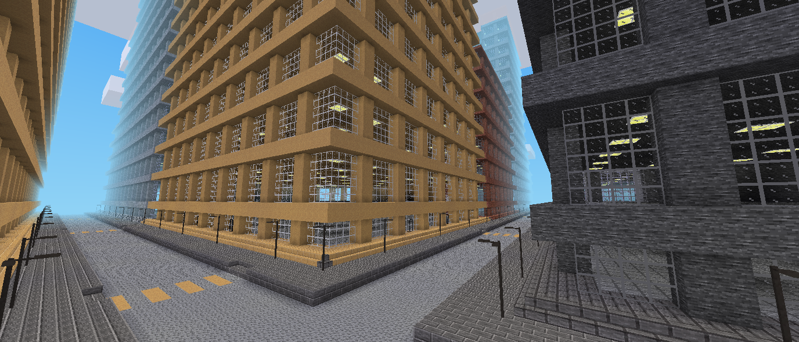

citygen -- minetest city mapgenerator

-----------------

A mod for [minetest](http://www.minetest.net)


# Overview

Generates a procedural city with prefabricated blocks and some randomization



# Recommended optional mods

* `morelights` for the streetlights and sewer lighting
* `street_signs` for the streetname signs

# How it works

The map is divided into 20 mapblocks (Variable: `citygen.cityblock_size`) along the z and x axis, called the "cityblock".
Those 20-mapblock squares are plotted once (and cached) with a predefined seed depending on their position on the map.
Streets are always aligned to the sides of the cityblock.
Relevant files for the plotting mechanism:
* [plot_streets.lua](plot_streets.lua)
* [plot_buildings.lua](plot_buildings.lua)


To ensure that the generated data is always the same a perlin-noise is derived from the current position of the cityblock.
The perlin generation is done in [perlin_manager.lua](perlin_manager.lua)

A plotted cityblock looks like this (a table with x and z axes):

```lua
cityblock = {
	{
		{ -- x axis
			{ -- z axis
				building_type = "citygen:default_building2",
				type = "edge",
				direction = "x+",
				height = 5
			},
			{
				building_type = "citygen:default_building2",
				type = "edge",
				direction = "x+",
				height = 5
			},
			{
				building_type = "citygen:default_building2",
				type = "corner",
				direction = "x+z+",
				height = 5
			}
		}
	},
	-- the
	root_pos = {
		z = 600,
		x = 720
	}
}
```

This data can be dumped on the console with the ingame command `/cityblock`.
The current mapblock data can be dumped with `/cityblock_mapblock`.
The "root_pos" is the lower, left mapblock of the cityblock.

This data is then passed to each mapblock that needs to be generated by the mapgen (See: [mapgen.lua](mapgen.lua))

The streetnames are picked randomly (depending on the x/z position of the street) from a catalog (See: [streetname.lua](util/streetname.lua))

The premade schematics are deseiralized onto the map with the help of the [mapblock_lib](https://github.com/BuckarooBanzay/mapblock_lib).
Some buildings have different variants with custom node-replacements, see: [default_buildings.lua](default_buildings.lua)

# Licenses

## Code

* MIT
