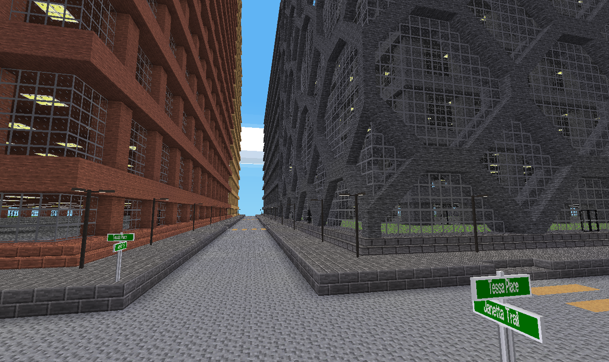

citygen -- minetest city mapgenerator

-----------------

A mod for [minetest](http://www.minetest.net)


[](https://content.minetest.net/packages/BuckarooBanzay/citygen/)

# Overview

Generates a procedural city with prefabricated blocks and some randomization



# Recommended optional mods

* `morelights` for the streetlights and sewer lighting
* `street_signs` for the streetname signs

# Updating the mod

Breaking changes can happen at any time, don't upgrade the mod if you plan on keeping you world-cityscape consistent!

# How it works

The map is divided into 20 mapblocks along the z and x axis, called the "cityblock".
Those 20-mapblock squares are plotted once (and cached) with a predefined layout depending on their position on the map.
Streets are always aligned to the sides of the cityblock.
Relevant files for the layouting mechanism:
* [layout.lua](layout.lua)
* [layout_parser.lua](layout_parser.lua)


To ensure that the generated data is always the same a perlin-noise is derived from the current position of the cityblock.
The perlin generation is done in [perlin_manager.lua](perlin_manager.lua)

A plotted cityblock looks like this (a table with x and z axes):

```lua
cityblock = {
	{
		{ -- x axis
			{ -- z axis
				groups = {
					building = true,
					edge = true
				},
				attributes = {
					building_type = "citygen:default_building2",
					height = 5
				},
				direction = "x+",
			},
			{
				groups = {
					building = true,
					edge = true
				},
				attributes = {
					building_type = "citygen:default_building2",
					height = 5
				},
				direction = "x+",
			},
			{
				groups = {
					building = true,
					corner = true
				},
				attributes = {
					building_type = "citygen:default_building2",
					height = 5
				},
				direction = "x+z+",
			}
		}
	},
	-- the
	root_pos = {
		z = 600,
		x = 720
	}
}
```

This data can be dumped on the console with the ingame command `/cityblock`.
The current mapblock data can be dumped with `/cityblock_mapblock`.
The "root_pos" is the lower, left mapblock of the cityblock.

This data is then passed to each mapblock that needs to be generated by the mapgen (See: [mapgen.lua](mapgen.lua))

The streetnames are picked randomly (depending on the x/z position of the street) from a catalog (See: [streetname.lua](util/streetname.lua))

The premade schematics are deseiralized onto the map with the help of the [mapblock_lib](https://github.com/BuckarooBanzay/mapblock_lib).
Some buildings have different variants with custom node-replacements, see: [default_buildings.lua](default_buildings.lua)

The schematics for a building contain 12 parts that get assembled depending on their position (bottom, corner, etc).
An example of the 12 parts in "exploded" view:


Each part can be edited by copying the files (manifest- and bin-file) out of the `schematics/building/` folder
and placing them into the `<worldfolder>/mapblocks/` folder.

Loading and saving the parts from the world and to disk is done with the `mapblock_lib` commands:
* `/mapblock_load <name>`
* `/mapblock_save <name>`

For example:
```bash
mkdir /my/world/mapblocks
cp schematics/street/street_all_sides* /my/world/mapblocks/
```

Ingame: `/mapblock_load street_all_sides` for loading and `/mapblock_save street_all_sides` to save

# Licenses

## Code

* MIT
